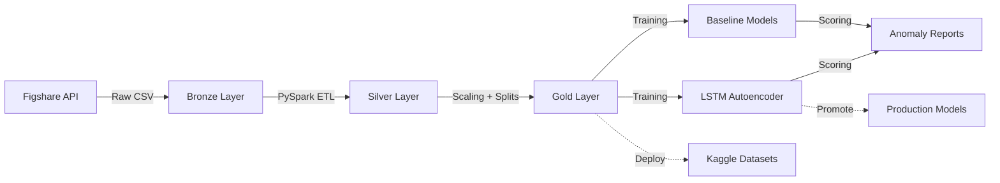

# AnomalyDetection4Pharma

**Advanced Anomaly Detection System for Pharmaceutical Tablet Manufacturing**

[](https://www.python.org/downloads/)
[](https://spark.apache.org/)
[](https://pytorch.org/)
[](https://opensource.org/licenses/MIT)

## 📋 Overview

A production-ready MLOps system for real-time anomaly detection in pharmaceutical tablet compression processes using physics-informed LSTM autoencoders. The system processes time-series sensor data from manufacturing equipment to identify quality deviations before they result in batch failures.

**Key Features:**
- 🏭 **Medallion Architecture**: Bronze → Silver → Gold ETL pipeline
- 🤖 **Dual Model Approach**: Isolation Forest baselines + LSTM Autoencoder
- ⚡ **Distributed Processing**: PySpark + MinIO for scalability
- 🐳 **Docker-Based**: GPU/CPU support, reproducible environments
- 📊 **MLOps Ready**: Kaggle deployment, model versioning, automated pipelines

## 🏗️ Architecture



### Data Flow

1. **Bronze**: Raw ingestion from Figshare collection (Zagar et al. 2022)
2. **Silver**: Feature engineering, batch filtering, diameter enrichment
3. **Gold**: MinMax scaling, temporal train/val/test splits
4. **Training**: Baseline (IsolationForest, PCA) + LSTM-AE
5. **Deployment**: Kaggle notebooks for reproducibility

## 🚀 Quick Start

### Prerequisites

- Docker & Docker Compose
- Python 3.12+
- NVIDIA GPU (optional, for CUDA acceleration)
- Kaggle API credentials (for deployment)

### 1. Clone & Setup

```bash
git clone https://github.com/YOUR_USERNAME/AnomalyDetection4Pharma.git
cd AnomalyDetection4Pharma

# Create .env file
cp .env.example .env
# Edit .env with your MinIO/S3 credentials
```

### 2. Start Infrastructure

```bash
# Auto-detects GPU and starts Docker containers
bash start_docker.sh

# Jupyter Lab: http://localhost:8888
# MinIO Console: http://localhost:9001
```

### 3. Run ETL Pipeline

```bash
# Complete Bronze → Silver → Gold pipeline
bash run_etl.sh
```

> ⚠️ **Note**: The ETL pipeline is under active development. If you encounter any issues, please [open an issue](https://github.com/jillpg/AnomalyDetection4Pharma/issues) on GitHub.

### 4. Train Models

```bash
# Inside Docker container
docker exec -it jupyter-pyspark python src/pipeline/train_pipeline.py

# Or train specific models
docker exec -it jupyter-pyspark python src/pipeline/train_pipeline.py --model baseline
docker exec -it jupyter-pyspark python src/pipeline/train_pipeline.py --model lstm
```

### 5. Deploy to Kaggle

```bash
# Deploy dataset only
bash scripts/ops/deploy_to_kaggle.sh --dataset

# Deploy specific notebook
bash scripts/ops/deploy_to_kaggle.sh --notebook lstm

# Deploy everything
bash scripts/ops/deploy_to_kaggle.sh --all
```

## 📁 Project Structure

```
AnomalyDetection4Pharma/
├── src/                      # Core source code
│   ├── etl/                  # ETL pipeline (Bronze/Silver/Gold)
│   ├── models/               # ML models (baselines, LSTM)
│   └── pipeline/             # Training orchestration
├── scripts/                  # Deployment & production scripts
├── notebooks/                # Jupyter notebooks & Kaggle configs
├── tests/                    # Unit tests
├── docker/                   # Docker configurations
├── run_etl.sh                # ETL orchestration
└── start_docker.sh           # Infrastructure startup
```

## 🧪 Data Pipeline

### Bronze Layer
- **Source**: Figshare Collection #5645578 (Zagar et al., 2022)
- **Output**: Raw CSV files in MinIO `bronze` bucket
- **Process**: Direct ingestion, ZIP extraction, filename standardization

### Silver Layer
**Transformations**:
- Timestamp parsing (UTC)
- Batch warmup removal (first 15 minutes)
- Fragment filtering (<100 rows)
- Diameter enrichment (physics-based formulas)

**Quality Rules**:
1. Remove silence periods (speed = 0)
2. Drop warmup batches (first 90 rows)
3. Filter fragments (<100 samples)

### Gold Layer
**Features**:
- MinMax scaling (0-1 normalization)
- Temporal splits: 60% train / 20% val / 20% test
- 6-dimensional tensor: `[dynamic_tensile_strength, ejection, tbl_speed, cyl_main, tbl_fill, pre_comp]`

## 🤖 Models

### Baseline Models
1. **Isolation Forest**
   - Contamination: 5%
   - 100 estimators
   - Unsupervised outlier detection

2. **PCA Reconstruction**
   - 3 components
   - Statistical anomaly scoring

### LSTM Autoencoder
- **Architecture**: Encoder-Decoder with attention
- **Input**: Sliding windows (60 timesteps)
- **Training**: MSE reconstruction loss
- **Inference**: Threshold-based anomaly detection

## 🧰 MLOps Workflows

### Typical Development Cycle

```bash
# 1. Data refresh
bash run_etl.sh

# 2. Train models
docker exec -it jupyter-pyspark python src/pipeline/train_pipeline.py

# 3. Deploy to Kaggle
bash scripts/ops/deploy_to_kaggle.sh --all

# 4. Promote champion model
bash scripts/ops/promote_model.sh
```

### Kaggle Integration
- **Datasets**: Automated versioning of Gold data
- **Notebooks**: Baseline, LSTM Training, Stress Testing
- **Models**: Champion model promotion workflow

## 📊 Testing

```bash
# Run unit tests
.venv/bin/pytest tests/ -v

# Expected: 5 tests pass in ~1.2s
```

## 🔧 Configuration

### Environment Variables (`.env`)
```bash
# MinIO/S3 Configuration
S3_ENDPOINT_URL=http://localhost:9000
BUCKET_BRONZE=bronze
BUCKET_SILVER=silver
BUCKET_GOLD=gold

# AWS Credentials (for MinIO)
AWS_ACCESS_KEY_ID=minioadmin
AWS_SECRET_ACCESS_KEY=minioadmin
```

### Kaggle Credentials
Place your API token at `~/.kaggle/kaggle.json`:
```json
{
  "username": "your_username",
  "key": "your_api_key"
}
```

## 📚 Scientific Background

This project implements methods from:

> Zagar, L., Kočar, D., Gradišek, A., Mekiš, N., & Veberic, R. (2022).  
> **Big data collection in pharmaceutical manufacturing**  
> *Figshare Collection*. https://doi.org/10.6084/m9.figshare.c.5645578

**Physics-Informed Features**:
- Dynamic tensile strength (stress state)
- Ejection force (friction)
- Tabletting speed (viscoelastic rate)
- Main cylinder height (tooling wear)

## 🛠️ Development

### Adding New Features
1. Update `src/config.py` → `ALL_SENSORS` constant
2. Modify `src/etl/etl_silver.py` → Feature engineering logic
3. Retrain models with `train_pipeline.py`

### Custom Models
1. Implement in `src/models/`
2. Register in `train_pipeline.py`
3. Update deployment configs in `notebooks/deploy/`

## 📝 License

This project is licensed under the MIT License - see [LICENSE](LICENSE) file for details.

## 🙏 Acknowledgments

- **Data Source**: Zagar et al. (2022) - Figshare pharmaceutical manufacturing dataset
- **Infrastructure**: PySpark, MinIO, Docker
- **ML Frameworks**: PyTorch, Scikit-learn

## � Author

**Name**: Jill Palma Garro  
**GitHub**: [@jillpg](https://github.com/jillpg)  
**LinkedIn**: [jillpg](https://www.linkedin.com/in/jillpg/)
